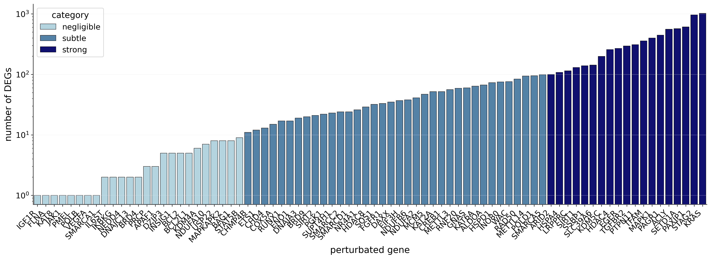
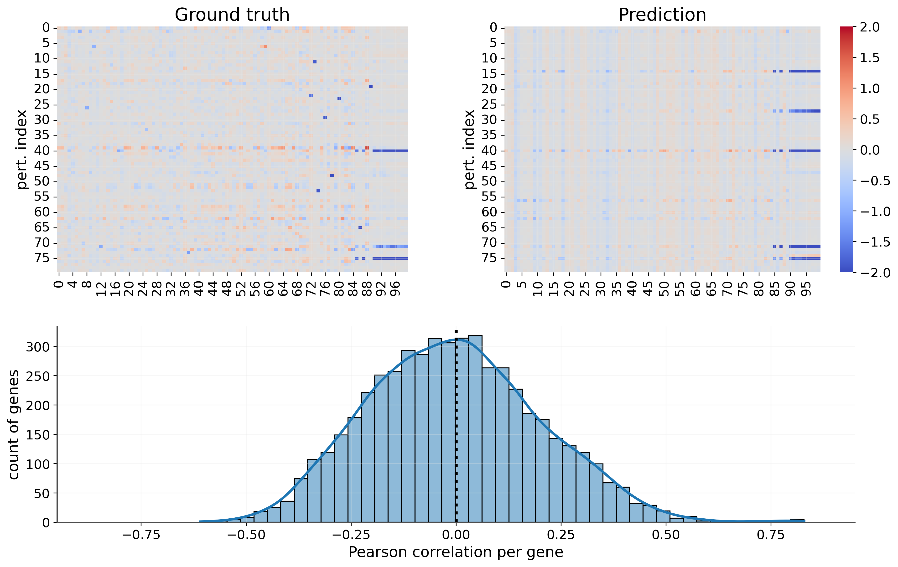

In this article we describe our efforts to understand how human cancer cell line responds to
perturbations induced by CRISPR-interference in the context of the ***Myllia | Echoes of Silenced
Genes: A Cell Challenge*** competition hosted on [Kaggle](https://kaggle.com).

Everything we did can be found in the corresponding [github repository](https://github.com/fsb2210/myllia-competition).


Credits for the front-page image: https://www.cnet.com/science/crispr-gene-editing-explained-what-is-it-and-how-does-it-work-genetic-engineering/

<!--more-->

## Data analysis

The nature of the database comprises genes (represented by their names) and their
response to perturbations of targeted genes. The first thing we realized is that the number of
samples: 80 perturbations for training and 60 for validation were too few. Having such a low number
of data points makes training a machine learning model extremely difficult given the high risk of
overfitting on training data.

The first analysis we perform is directly tied to what kind of perturbations we have in our
training set, in particular we wanted to answer the question: *how many targeted genes react to a
given perturbation?*. This essentially means to count how many differentially expressed genes (DEG)
each perturbation produces.

Directly from this figure we can derive the following values:
- negligible perturbations (< 10 DEGs): 25,
- subtle perturbations (< 100 DEGs): 37,
- strong perturbations: 18.

Thus, the data is well distributed for the three type of perturbations we defined, namely,
*negligible*, *subtle* and *strong*. This information will be useful later on, when we start
training our models, as it provides a clean way to split the data into stratified folds.

## Data augmentation and pre-processing


The implementation of the pre-processing steps can be found in the [preprocessing-steps](https://github.com/fsb2210/myllia-competition/blob/main/notebooks/preprocessing-steps.ipynb)
jupyter notebook


As mentioned earlier, the small number of training samples prevents us from using the training
data as it is: we need to augment what was provided with external datasets. For that, we use four
publicly-available single-cell perturbation datasets, from two different sources:

1. Replogle et al., 2022: **K562** and **RPE1** datasets.
2. Nadig et al., 2025: **HepG2** and **Jurkat** datasets.

These two works have widely been used for works on similar topics of predicting responses to
perturbations.

The first step taken after downloading such datasets was to compute the same pre-processing steps
as the ones described in the challenge. This is a must-do task in order to be able to use them in
the same context as our training set. This was achieved thanks to the [pdex](https://github.com/ArcInstitute/pdex)
package that computes *differential expression for single-cell perturbation sequencing in
parallel*.

Schematically,

* **Input data:** Raw UMI counts for the entire set of genes in the external dataset.
* **Normalization:** Log-normalized counts applied uniformly.
  $$
  x_{norm} = \log_2\left(\frac{x_{raw}}{\sum x_{raw}} \times 10,000 + 1\right)
  $$
* **Gene subset:** Data subsetted to the **5,127 target genes** relevant to the challenge.
* **Pseudo-Bulk (PB) aggregation:** Single-cell counts averaged per perturbation condition
  (arithmetic mean), disregarding batch information.


In reality, not every target gene was present in the external dataset, so we add those missing
genes by imputing some "dummy" values in them.
In particular, we set
 - DEG = 0 (not a DEG)
 - FDR = 1.0 (max value, meaning *not significant*)

This represents an honest "no information" prior rather than introducing biased guesses.


## Feature and target engineering

Once all datasets are in the same format, we can compute statistical signatures to identify
perturbations across different cell-lines. After several tests, we choose to include two types of
features: **gene signatures** and **protein embeddings**.

### Gene signatures

* **Signature computation**: Compute PB differentially-expressed (PB-DE) vectors for each
  perturbation in all the external datasets using the same normalization.
* **Signature weighting**: Assign weights by applying a *min-max* approach to the `-log10(fdr)`
  values, per-perturbation.
* **Gene-Level Aggregation:** Group PB-DE vectors by gene symbols across all external cell lines,
  then sum them at the gene-level (per-perturbation).
* **Dimensionality reduction:** Fit a Principal Component Analysis (PCA) *only* on the aggregated
  external signature matrix to prevent data leakage during training.
* **Lookup table:** Create the mapping `Gene Symbol` $\rightarrow$ `PCA Vector`, one for the
  training and other for the validation sets.

### Protein embeddings

We used an evolutionary scale modeling from *Meta-AI* to convert amino acid sequences into embedding
vectors.

* **Model:** `esm2_t33_650M_UR50D`.
* **Input:** Amino acid sequences for each perturbed gene.
* **Output:** Fixed-length protein embedding vector of shape $(1, 1280)$.

### Concatenated features

Finally, we build the final features matrix for the training and validation datasets by
concatenating the two previously mentioned features:

* **Hybrid Vector:** for each perturbation (training/validation), features concatenated as follows:
  $$
  \vec{f} = \text{ESM2} \oplus \text{PCA-signature} \oplus \text{DEG-count}
  $$
  * ${\rm ESM2}$: Protein embedding (1280 dims).
  * ${\rm PCA}$: External PCA signature (`n_latent` dims). If gene missing from external
    lookup, imputed with zeros.
  * ${\rm DEG-count}$: Normalized number of DEGs per perturbation across external
    datasets.
* **Total Feature Dimension:** for `n_latent = 300`, $1280 + 300 + 1  = \mathbf{1581}$.

Thus, our input matrix contains 80 samples, each having 1581 elements that will be used to predict
responses of the 5127 target genes of the challenge.

## Model

Having prepared features as mentioned in the previous step, we are now ready to train a machine
learning model.

Given the small sample size, complex non-linear approaches such as neural networks are likely to
overfit and fail to generalize to unseen perturbations. Thus, we decided to work with simple but
powerful classical machine learning models. We experimented with several linear models including
*Ridge*, *ElasticNet*, and *Lasso*. Below, we describe the main ideas behind the training loop for
our best-performing model.

### Model architecture

* **Algorithm:** Ridge regression from the `sklearn` package.
* **Regularization values:** we try several alpha-values: $[10^{-2}, 10^{-1}, 10^{0}, 10^{1}, 10^{2}]$.
* **Objective:** Minimizes Mean Squared Error (MSE) with $L_2$ penalty.
  $$
  \min_{w} \|Xw - Y\|_2^2 + \alpha \|w\|_2^2
  $$

### Cross-validation scheme

Very importantly for us, given the small sample size, is the usage of a cross-validation (CV)
technique that could help us have a reliable score for unseen perturbations. Thus, we use a
*stratified K-fold* approach, using the information mentioned earlier (in the **Data analysis**
section).

* **Strategy:** 10-Fold KFold cross-validation.
  * **Splits:** `n_splits = 10`.
  * **Shuffle:** True (`random_state = 42`).
* **Out-of-Fold (OOF) predictions:** Accumulated across folds to evaluate generalization on the 80
  training samples.

### Magnitude calibration

We observed that predictions from linear models tend to shrink toward zero, resulting in lower
variance than the true values ($\sigma_{\text{pred}} < \sigma_{\text{true}}$). This negatively
impacts the mean absolute error (MAE) component of the competition metric. To address this, we
apply a post-hoc scaling step.

* **Scaling factor ($\gamma$):** Computed per fold during CV (for OOF).
  $$
  \gamma = \frac{\text{std}(Y_{true})}{\text{std}(Y_{pred})}
  $$

Then, each prediction is scaled before being evaluated:
$$
    Y_{\rm final} = \gamma \times Y_{\rm pred}
$$

## Results

For the linear model described earlier, we found the following values after the training loop:

- ***Overall OOF (all 80 samples)***:
  - *score*:    3.2983
  - *sum_wmae*: 7.1694
  - *wcos*:     0.4601
- ***Diagnostics***:
  - *median of scaling factors*: 2.445
  - *pred_std/true_std ratio*: 1.079

This same model was submitted to the competition an achieved  *Leaderboard (LB) score* of 2.74!

The figure above shows how our model's predictions compare to true gene responses. Importantly,
these are out-of-fold predictions: the model that generated each prediction was not trained on that
specific perturbation, thus avoiding data leakage.

## Concluding Remarks

### What We Learned

* **Small data demands simple models**: With only 80 training perturbations, complex models
  overfit quickly. Ridge regression provided a stable, interpretable baseline that generalized
  better than more flexible alternatives.

* **External data is a must, and it must be aligned**: Augmenting with four external single-cell
  datasets significantly enriched our feature space. However, careful alignment was essential to
  avoid introducing noise or bias.

* **Proper cross-validation analysis**: Stratified K-fold CV informed by perturbation strengths
  gave us a reliable estimate of generalization performance on a hidden test set.

### Limitations

- **Sample size**: 80 training perturbations is extremely limited for learning complex
  *gene-regulatory* relationships. Our approach prioritizes robustness over expressiveness.

- **Cell-line mismatch**: External datasets come from different cell lines (K562, RPE1, HepG2,
  Jurkat) than the challenge data. Biological context differences remain a source of noise.

- **Feature independence assumption**: We concatenated ESM2 embeddings and external signatures
  without modeling their interactions. A more sophisticated architecture might capture
  their effects altogether.

### What we didn't try in depth

- **Residual learning**: Train a simple model (Ridge) for the linear signal, then use a regularized
  non-linear model (LightGBM with extreme regularization) to capture residuals. This hybrid
  approach could add flexibility without overfitting.

- **Gene graph priors**: Incorporate known gene-gene interaction networks to encourage biologically
  plausible predictions.

- **Ensembling**: Combine predictions from multiple feature sets or model types to reduce variance
  and improve robustness.

### Final Thoughts

Predicting cellular responses to genetic perturbations is a fundamental challenge in systems
biology and drug discovery. While our entry represents a modest step, the methodological lessons
of careful data harmonization, metric-alignment on engineered features, and conservative modeling
under data scarcity, are broadly applicable.

We thank the Myllia competition organizers for creating a well-structured challenge that highlights
real-world constraints in computational biology.

All code and notebooks are available at [github.com/fsb2210/myllia-competition](https://github.com/fsb2210/myllia-competition).
